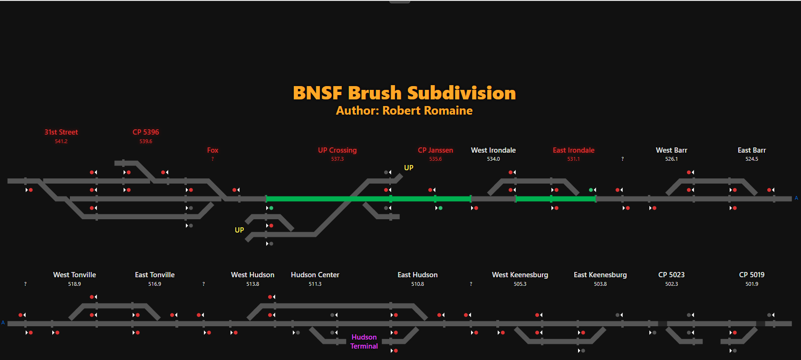
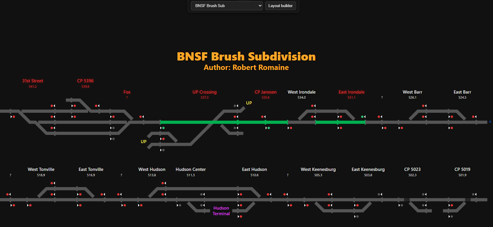
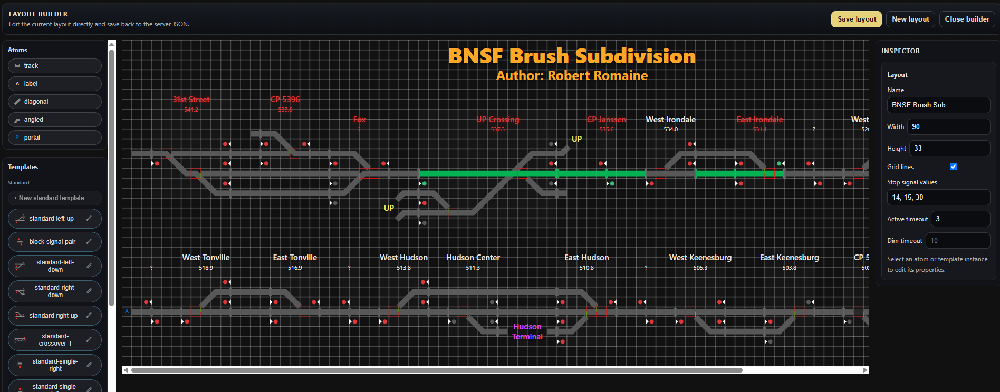
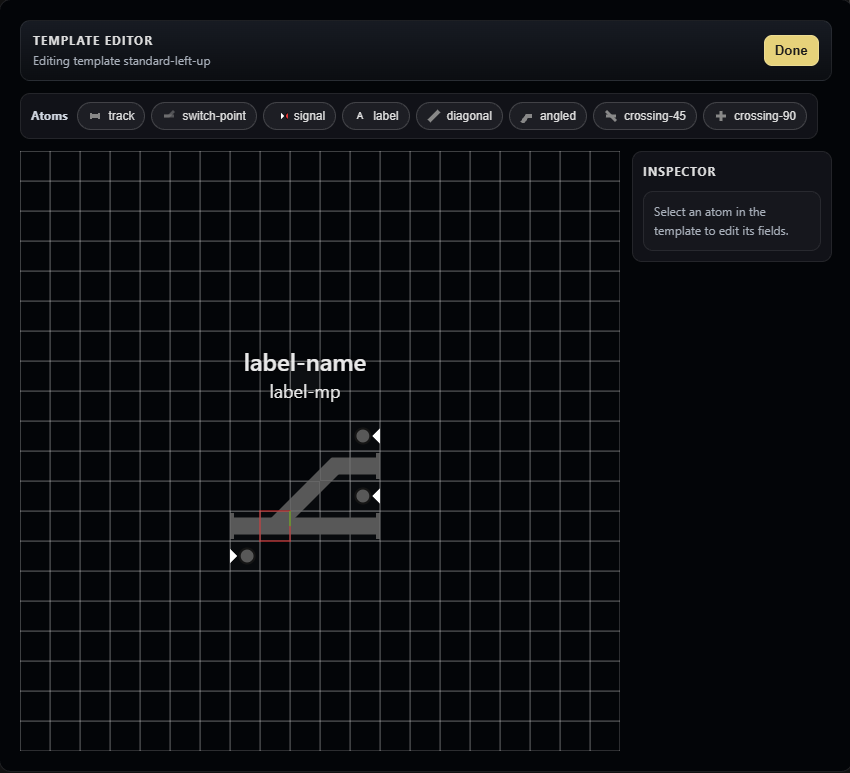

# Layout Builder Guide

ItcVue's Layout Builder lets you create and maintain the diagram that appears in the monitor display. A layout is made from individual atoms, such as track and labels, plus reusable templates for more complex control points.

## 1. Open a Layout

Start ItcVue and choose a layout from the selector in the top bar.

The normal monitor view displays the selected layout and its live state.

## 2. Enter and Leave the Layout Builder

Select **Layout builder** in the top navigation. The selected layout opens in editing mode. The button becomes **Return to monitor** while the builder is open.

Use **Save layout** when you are ready to keep your work. Saving updates the layout and returns you to monitor mode. Use **Close builder** or **Return to monitor** to leave without saving; unsaved draft edits are discarded.

You can select another editable layout from the top selector while the builder is open. The builder stays open for the new layout, but you should save first if you want to retain the current draft.

## 3. Create a New Layout

From **Layouts (Local)**, choose **New layout**, then enter a name and starting width and height. The new blank layout opens directly in the Layout Builder.

Choose dimensions that give the diagram enough room to grow. You can expand a layout later from the settings panel.

## 4. Builder Overview

The builder has four main areas:

- The **palette** contains atoms and available templates.
- The **grid canvas** is the layout being built.
- The **inspector** shows settings for the selected item or for the layout itself.
- The top controls let you save, create a new layout, or close the builder.

The grid is the coordinate system for a layout. Place items on cells rather than trying to position them by pixels.

## 5. Place, Select, and Move Items

Drag an atom or template from the palette to the canvas. During a drag, ItcVue shows a translucent preview that snaps to the grid cell where the item will be placed when released.

Select an item by clicking it. You can then change its settings in the inspector, drag it to another valid cell, or use the arrow keys to move it one cell at a time.

To work with a group:

- Hold Ctrl (or Command on macOS) while clicking items to add them to the selection.
- Drag on empty canvas space to draw a selection rectangle around several items.
- Drag the selected group or use the arrow keys to move it as a group.

The entire group stops when any selected item would leave the canvas. Items are not allowed to spill off the edge or pile up at the boundary.

If track-like items occupy the same grid cell, the affected cell is highlighted in magenta. Treat that as a prompt to separate the overlapping pieces before saving.

Right-click an item or a group to copy it. Right-click a destination cell and choose **Paste**. The pasted group keeps its relative spacing. If the group cannot fit at that location, ItcVue leaves the layout unchanged and reports that the destination is invalid.

## 6. Work with Common Atoms

The palette includes the basic parts used to construct a layout:

- **Track** creates straight horizontal or vertical track. Set its length and rotation in the inspector.
- **Label** adds station, control-point, or other text. Adjust its text, color, and offset in the inspector.
- **Diagonal** and **angled** track create non-orthogonal rail geometry. Use rotation and flip controls to obtain the desired direction. The **Contain within cell** option keeps a compact diagonal or angled piece within its grid cell.
- **Portal** connects named locations elsewhere in the layout. Give both sides the same portal name when they are intended to connect.

Template instances contain more complex pieces such as switches, crossings, signals, and compound track arrangements.

For manually entered values, the builder validates the input when you leave the field or press Enter. Canvas dimensions, positions, and track lengths use whole cells. Layout label offsets can use whole-cell or half-cell increments. Invalid values are not applied, and a straight track length is reduced automatically when necessary to keep it inside the canvas.

## 7. Use Templates

Templates are reusable groups of atoms. Adding a template instance to a layout is the normal way to place a repeated control point or track arrangement.

The palette separates templates into two groups:

- **Standard templates** are supplied with ItcVue and are normally read-only.
- **Custom templates** belong to the current layout and can be created or edited for layout-specific geometry.

To add a template instance, drag it from the palette to the canvas. Select the instance to set its display name, WIU identifier, signal and switch counts, and other instance properties.

Choose **New template** to make a custom template, or use the edit control beside a custom template in the palette to open the Template Editor.

## 8. Edit a Custom Template

The Template Editor opens over the Layout Builder, with its own palette, grid, and inspector. The underlying layout is visually de-emphasized so it is clear that you are editing template geometry.

Add and arrange template atoms as you would normal layout atoms. Each atom has a **role**, such as `track-1` or `signal-2`. Roles must be unique within the template because template instances use them to associate live data and labels with the correct component.

Use the inspector to configure atom-specific options, including direction, track role, label text, and signal or switch information. Choose **Done** to return to the Layout Builder, then save the layout to keep the template definition.

## 9. Connect Template Instances to Live Data

For a template instance that represents a real location, select it and enter its **WIU ID**. Set the number of signals and switches expected from that unit, then map the instance's template roles to the appropriate live signal and switch indexes.

You can paste a different WIU ID without counts changing immediately. This makes it practical to duplicate a similar instance, update the WIU ID, and then make any required address or count changes yourself.

When instances sharing a WIU have incompatible packet counts, saving presents a review choice. Choose **Normalize and save** to make the shared counts consistent, or cancel the save and correct the instances manually.

In monitor mode, a magenta label means ItcVue is receiving packets for that WIU but cannot decode the configured mapping correctly. Check the instance's WIU, packet counts, and role-to-index mappings.

## 10. Adjust Layout Settings

With no item selected, use the layout settings panel to edit the layout name, width, height, and signal stop values.

You can expand the canvas at any time. When reducing its width or height, ItcVue will not move or remove items. It stops at the smallest size that still contains every placed atom and template instance. If you type a smaller number manually, it is adjusted to that safe minimum.

Signal stop values are comma-separated values used by the monitor display to determine where a route should stop. The standard values are usually appropriate unless the layout has a specific reason to change them.

## 11. Direction and Coordinates

The builder uses railroad-style display coordinates:

- X increases from left to right.
- Y increases upward.
- A track rotation of 0 is horizontal; 90 is vertical.
- A signal's facing direction indicates the direction the signal protects or governs.

For a typical eastbound route, place a right-facing signal to the left of the route it governs. For a westbound route, place a left-facing signal to the right of the route it governs. Verify directions in monitor mode using the expected signal and route behavior.

## 12. A Practical Workflow

1. Create or open a local layout, then enter the builder.
2. Set the canvas size large enough for the territory.
3. Place basic track and labels, using the grid and drag preview for alignment.
4. Add standard templates for common control points and custom templates for layout-specific arrangements.
5. Configure each live template instance with its WIU ID, counts, and mappings.
6. Check the canvas for magenta overlap cells and correct any unintended overlaps.
7. Save the layout and review it in monitor mode.
8. If labels are magenta in monitor mode, correct the affected instance's live-data mapping and save again.

Build in small, saved increments. It is much easier to verify a station or control point as it is added than to diagnose a large layout all at once.
